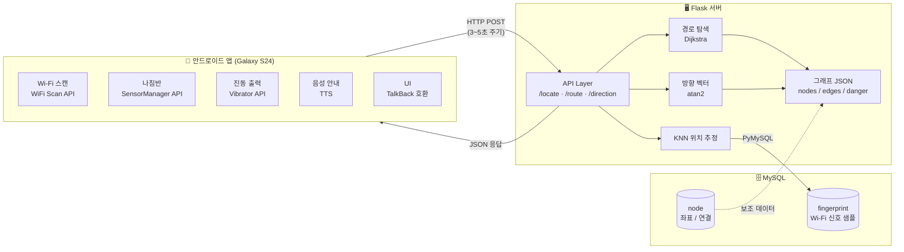
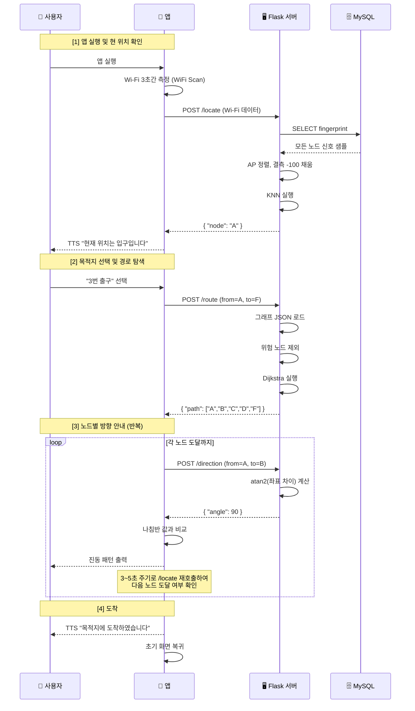
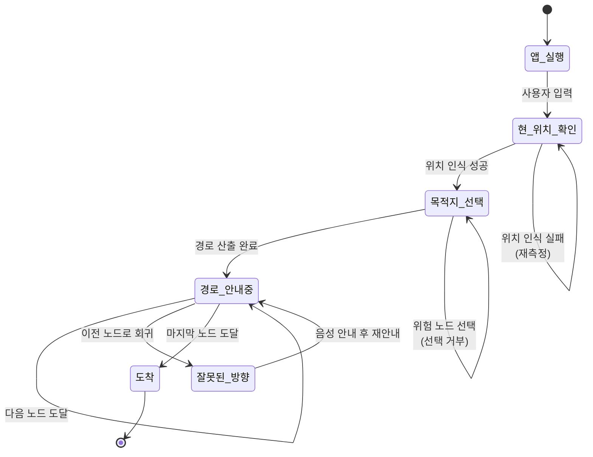

# 03. 시스템 아키텍처

## 3.1 전체 시스템 구성도

본 시스템은 **안드로이드 앱(클라이언트)**, **Flask 서버(백엔드)**, **MySQL 데이터베이스** 의 3-Tier 구조로 구성된다.

### 3.1.1 계층별 책임

| 계층 | 책임 |
|---|---|
| **클라이언트(앱)** | 센서 데이터 수집(Wi-Fi, 나침반), 사용자 피드백 출력(진동, 음성), 사용자 입력 처리 |
| **API 계층(Flask)** | HTTP 요청 수신, 입력 검증, 응답 직렬화 |
| **도메인 로직(서버)** | 경로 탐색, 방향 계산, 위치 추정 |
| **데이터 계층(MySQL)** | Wi-Fi fingerprint 샘플 보관, 노드 메타데이터 보관 |

### 3.1.2 단일 책임 원칙

각 계층은 다음 원칙을 따른다.

- **앱은 계산하지 않는다** — 모든 의사결정은 서버가 수행한다.
- **서버는 사용자와 직접 소통하지 않는다** — 서버 응답은 항상 앱이 해석하여 사용자에게 전달한다.

---

## 3.2 주요 컴포넌트 설명

### 3.2.1 안드로이드 앱

| 컴포넌트 | 역할 |
|---|---|
| Wi-Fi 수집 모듈 | 주기적으로 주변 AP의 BSSID와 RSSI를 수집한다. |
| 나침반 모듈 | 자기센서를 통해 스마트폰 상단이 향하는 절대 각도를 측정한다. |
| 진동 출력 모듈 | 서버 응답으로 받은 절대 각도와 현재 나침반 값을 비교해 적절한 진동 패턴을 출력한다. |
| 음성 출력 모듈 | TTS를 통해 안내 문구를 발화한다. |
| UI 모듈 | TalkBack 호환 UI를 제공한다. ‘현 위치 확인’ / ‘이동 방향 탐색’ 버튼이 핵심이다. |

### 3.2.2 Flask 서버

| 컴포넌트 | 역할 |
|---|---|
| API 라우터 | `/locate`, `/route`, `/direction` 엔드포인트를 정의한다. |
| 경로 탐색기 | 그래프 JSON과 위험 노드 정보를 입력으로 받아 Dijkstra를 수행한다. |
| 방향 벡터 계산기 | 두 노드의 좌표를 입력으로 받아 `atan2`로 절대 각도를 산출한다. |
| KNN 호출 래퍼 | 앱이 보낸 Wi-Fi 데이터를 정렬·결측 처리한 뒤 KNN 모듈에 전달하고 결과를 받는다. |

### 3.2.3 MySQL 데이터베이스

| 테이블 | 보관 내용 |
|---|---|
| `fingerprint` | 각 노드에서 사전 수집한 Wi-Fi AP들의 RSSI 샘플 |
| `node` | 노드 ID, 좌표, 다음 노드 정보 |

---

## 3.3 통신 흐름

### 3.3.1 전체 시퀀스 다이어그램

### 3.3.2 통신 주기

> 해당 과정을 3~5[sec] 주기로 반복한다. 시각장애인의 이동속도, 서버 딜레이를 고려한 시간이다. *(원본 요구사항 명세서 中)*

3초 미만의 짧은 주기는 서버 부하 및 배터리 소모를 가중시키며, 5초 초과는 사용자가 다음 노드를 지나친 뒤에야 인지하는 문제가 발생할 수 있다.

---

## 3.4 사용자 시나리오

### 3.4.1 표준 시나리오 (정상 흐름)

> 원본 요구사항 명세서의 사용 시나리오 8단계

1. 사용자가 지하철 입구에서 어플을 실행한다.
2. 어플 실행 후 현재 위치를 인식한다 (지하철 입구로 정상 인식).
3. 어플을 통해 목적지를 설정한다.
4. *"이동 방향을 확인하세요"* 음성을 들은 후 방향을 잡고 화면의 ‘이동 시작’을 터치한다.
5. 다음 노드 도달 시 해당 위치임을 인식하는지 확인한다.
6. 5~6 과정을 반복한다.
7. 에스컬레이터가 있는 노드 도착 시 위험 안내 음성이 출력된다.
8. 마지막 노드(도착지) 도달 시 *"목적지에 도착하였습니다"* 음성 후 종료된다.

### 3.4.2 상태 다이어그램

### 3.4.3 예외 흐름

| 예외 상황 | 시스템 동작 |
|---|---|
| 위치 인식 실패 | 재측정 또는 사용자에게 위치 재요청 |
| 위험 노드를 목적지로 선택 | "목적지로 설정 불가한 위치입니다." 음성 안내 후 목록 화면으로 복귀 |
| 다음 노드 미도달 (제한시간 초과) | "반대 방향으로 이동하였습니다." 음성 안내 |
| 이전 노드 재인식 | 동일 — 잘못된 방향으로 간주 |
| 통신 실패 | (구현 시 결정) — 재시도 정책 필요 |
