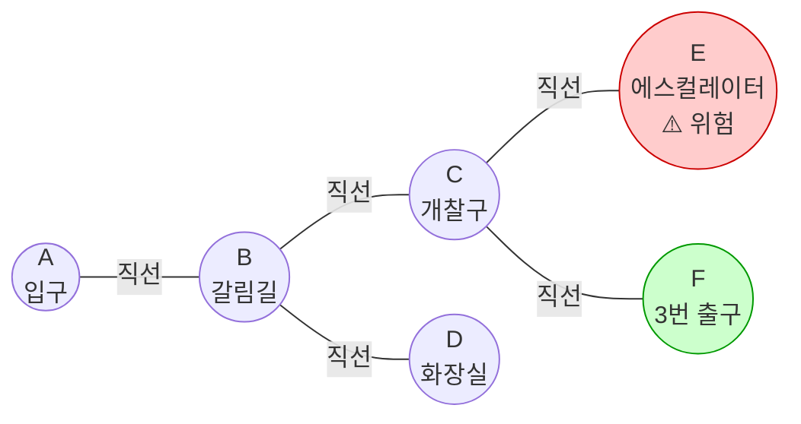
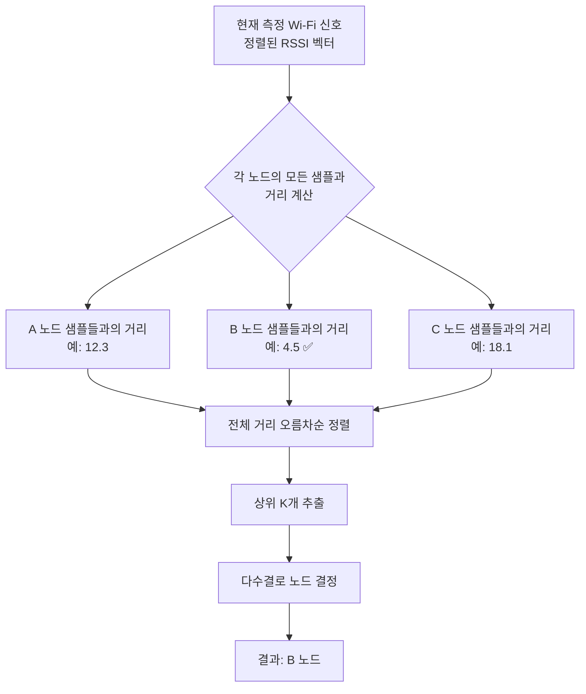

# 04. 핵심 기술 개념

## 4.1 노드 그래프 모델

### 4.1.1 노드의 정의

본 시스템에서 **노드(Node)** 는 지하철역 내부의 **갈림길이 발생하는 지점**으로 정의한다.

> 모든 엣지(링크, 노드-노드 사이의 길)가 직선으로만 존재하도록, 2방향 이상의 갈림길이 발생하는 모든 위치 정보를 수집하여 DB화 한다. *(원본 요구사항 명세서 中)*

### 4.1.2 핵심 가정: 직선 통로

노드 간을 연결하는 **엣지(Edge)** 는 **반드시 직선**으로 가정한다. 이 가정은 다음과 같은 효과를 낳는다.

- 노드 간 방향이 **단일 벡터**로 표현 가능 (벡터 연산 단순화)
- 사용자가 진행 도중 방향을 바꿀 필요가 없음 (진동 안내가 직관적)
- 곡선 통로가 존재하는 경우, 곡선의 변곡점마다 노드를 추가 배치하여 직선의 연속으로 표현

### 4.1.3 그래프 예시



### 4.1.4 거리 정보의 부재

본 모델은 **노드 간 거리 정보를 보유하지 않는다**. 대신 사용자가 다음 노드에 도달하는지를 **제한 시간(Time Out)** 기준으로 판정한다. 이는 다음 이유에서 채택되었다.

- 사용자별 이동 속도 편차가 크다.
- 정확한 거리는 위치 추정 정확도에 큰 영향을 주지 않는다.
- 거리 측정 자체가 추가 인프라(BLE 비콘, 비전 등)를 요구하므로 비용이 크다.

---

## 4.2 Wi-Fi Fingerprinting

### 4.2.1 개념

**Wi-Fi Fingerprinting** 은 특정 위치에서 관측되는 **Wi-Fi AP들의 신호 세기 패턴(=fingerprint)** 이 위치마다 고유하다는 사실을 이용한 실내 위치 추정 기법이다.

### 4.2.2 동작 원리

1. **사전 수집(Offline)**: 각 노드 위치에서 주변 Wi-Fi AP의 BSSID·RSSI를 다수 회 측정해 DB에 저장한다.
2. **실시간 측정(Online)**: 사용자의 스마트폰이 현재 위치의 Wi-Fi AP를 스캔한다.
3. **매칭(Matching)**: 측정된 패턴을 DB의 모든 노드 패턴과 비교하여 가장 유사한 노드를 현재 위치로 추정한다.

### 4.2.3 측정 데이터 정의

> 수집데이터는 AP명, BSSID, RSSI, 측정 위치(위치 명)를 필수로 하며, 부가적으로 SSID, 주파수, 채널을 요구한다. *(원본 요구사항 명세서 中)*

| 필드 | 설명 | 필수 여부 |
|---|---|---|
| BSSID | AP의 MAC 주소. AP 식별 키. | 필수 |
| RSSI | 신호 세기 (단위: dBm, 일반적으로 -30 ~ -90) | 필수 |
| 측정 위치(노드 ID) | 어느 노드에서 측정했는지 | 필수 |
| SSID | AP의 이름(네트워크명) | 부가 |
| 주파수 | 2.4GHz / 5GHz | 부가 |
| 채널 | Wi-Fi 채널 번호 | 부가 |

### 4.2.4 결측 AP 처리

> DB와 비교했을 때 없는 AP가 존재시 ‘-100’ 값을 입력하여 매우 약한 신호로 처리한다. *(원본 요구사항 명세서 中)*

DB에는 존재하나 실시간 측정에서 감지되지 않은 AP, 혹은 그 반대인 AP에 대해서는 **`-100 dBm`(매우 약한 신호)** 으로 통일한다. 이는 KNN 거리 계산을 위한 차원 일치를 보장한다.

### 4.2.5 AP 정렬 규칙

> Wifi AP의 순서는 DB의 구조와 동일하게 정렬되어야 한다. 서버는 앱에서 Wifi Data를 받은 후 서버에서 정렬을 수행 후 KNN 알고리즘을 실행한다. *(원본 요구사항 명세서 中)*

KNN 거리 계산은 벡터 차원 순서가 일치해야 의미가 있으므로, 서버는 입력 데이터를 **DB의 BSSID 순서**에 맞춰 정렬한 뒤 KNN에 전달한다.

---

## 4.3 KNN 위치 추정

### 4.3.1 알고리즘 개요

**K-Nearest Neighbors (KNN)** 은 입력 샘플과 학습 데이터들 간의 거리를 계산하고, 가장 가까운 K개의 이웃이 가지는 라벨 중 다수를 출력 라벨로 채택하는 분류 알고리즘이다.

본 시스템에서는 다음과 같이 적용된다.

- **입력**: 현재 측정한 Wi-Fi 신호 벡터 (정렬된 BSSID 순서 기준 RSSI 값들)
- **학습 데이터**: DB에 저장된 각 노드의 fingerprint 샘플들
- **거리 함수**: 유클리드 거리 (또는 맨해튼 거리)
- **출력**: 가장 가까운 K개 샘플 중 가장 많이 등장한 노드 ID

### 4.3.2 동작 흐름



### 4.3.3 K 값 선정 원칙

- **K=1**: 가장 가까운 샘플의 노드를 그대로 채택. 이상치(outlier)에 취약하지만 구현이 단순.
- **K=3 또는 5**: 다수결을 통해 안정적인 결과. 본 프로젝트의 기본값으로 권장.
- 짝수는 동률 발생 시 처리 복잡도가 증가하므로 **홀수** 권장.

### 4.3.4 (선택) 다수결 보정

> (필요시 추가) 위치 포인트 추정시 3초간 측정한 결과를 받아 가장 많이 나온 노드를 결과로 반환한다. *(원본 요구사항 명세서 中)*

위치 추정의 안정성을 높이기 위해, 3초간의 다중 측정 결과 중 다수결로 최종 노드를 결정하는 옵션이 있다. 본 프로젝트에서는 **초기 구현에서는 단일 측정으로 시작하고, 필요 시 추후 도입**한다.

---

## 4.4 방향 안내 메커니즘

### 4.4.1 방향 안내의 두 정보원

방향 안내는 두 가지 데이터의 결합으로 이루어진다.

1. **절대 방향 (서버)**: 현재 노드 → 다음 노드 사이의 절대 방향 (도 단위, 0~360°)
2. **현재 방향 (앱)**: 사용자 스마트폰 상단이 향하는 절대 방향 (나침반)

### 4.4.2 절대 방향 계산

두 노드 좌표 `(x1, y1)`, `(x2, y2)` 가 주어지면, 절대 각도는 다음과 같이 계산된다.

```python
import math
angle = math.degrees(math.atan2(y2 - y1, x2 - x1))
# 0~360 정규화
angle = (angle + 360) % 360
```

### 4.4.3 방향 보정의 필요성

> Vector 연산으로 절대적인 노드 간 방향을 알 수 있으나, 사용자가 바라보는 방향이 틀어져 있을 수 있으므로 자기데이터(나침반)와 비교하여 보정한다. *(원본 요구사항 명세서 中)*

**절대 방향만 알려주는 것으로는 부족하다**. 사용자가 어느 쪽을 바라보고 있는지를 모르기 때문이다. 따라서 앱은 절대 방향에서 **나침반 값을 차감**하여 *"현재 진행 방향 기준으로 얼마나 빗나갔는지"* 를 산출해야 한다.

```
빗나감 각도 = (절대 방향 - 나침반 값 + 360) % 360
```

### 4.4.4 진동 출력 규칙

| 빗나감 각도 (절대값) | 진동 패턴 |
|---|---|
| 60° ~ 30° | 초당 1회 약한 진동 |
| 30° ~ 15° | 초당 2회 약한 진동 |
| 15° 이내 | 정확한 방향 (별도 알림 없음) |

> 정확한 방향에서 ±60° ~ 30°인 경우 초당 1회 약한 진동을 발생한다.
> 정확한 방향에서 ±30° ~ 15°인 경우 초당 2회 약한 진동을 발생한다. *(원본 요구사항 명세서 中)*

방향이 맞을수록 진동 빈도가 강해지는 직관적 피드백을 제공한다.

---

## 4.5 위험 노드 처리

### 4.5.1 위험 노드의 정의

**위험 노드(Danger Node)** 는 시각장애인이 단독 통과 시 사고 위험이 있는 지점을 의미한다. 대표적으로 다음이 포함된다.

- 에스컬레이터
- 가파른 계단
- 좁은 통로
- 공사 중 구간

### 4.5.2 위험 노드의 동작

위험 노드는 다음 두 가지 방식으로 시스템에 영향을 준다.

| 영향 영역 | 동작 |
|---|---|
| 경로 탐색 | 경로 계산 시 위험 노드를 **자동으로 제외**한다. |
| 목적지 선택 | 위험 노드를 목적지로 지정하려 시도하면 **거부**되고 음성 안내한다. |
| 인접 통과 | 경로 상 위험 노드를 **인접 통과해야 할 경우** 사전 음성 안내. |

> 최단거리가 아닌 위험 노드를 피하여 도달 가능한 경로를 탐색한다. *(원본 요구사항 명세서 中)*

### 4.5.3 데이터 표현 방식

본 프로젝트에서는 **별도 테이블이 아닌 JSON 파일** 로 위험 노드를 관리한다.

```json
// danger.json
["E", "G3"]
```

이는 다음 이유에서다.

- 위험 노드는 자주 변경되지 않으며 항목 수가 적다.
- DB 조회 비용 없이 메모리 내 `set` 으로 즉시 검사 가능하다.
- 구현 단순성과 운영 편의성을 동시에 확보한다.
