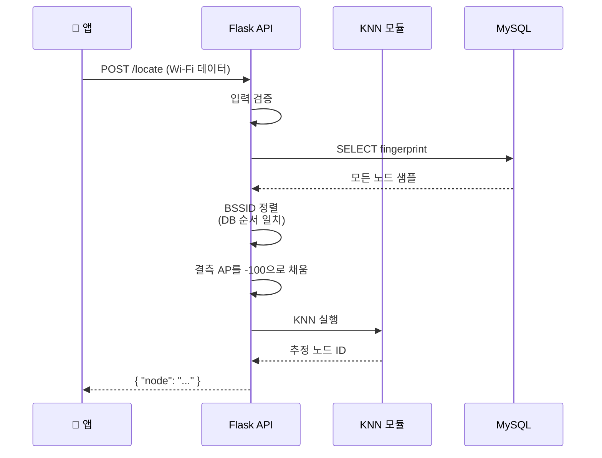
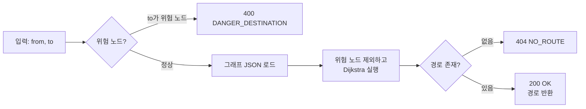

# 05. API 명세

## 5.1 API 개요

### 5.1.1 공통 사양

| 항목 | 값 |
|---|---|
| 프로토콜 | HTTP/1.1 |
| 메서드 | POST |
| Base URL | `http://<server-host>:<port>` *(개발 환경에서 결정)* |
| Content-Type | `application/json; charset=utf-8` |
| 응답 인코딩 | UTF-8 JSON |
| 인증 | 없음 *(요구사항 명세서에 명시 없음)* |

### 5.1.2 엔드포인트 목록

| # | Endpoint | 기능 | 호출 주체 |
|---|---|---|---|
| 1 | `POST /locate` | 현재 위치 추정 | 앱 (3~5초 주기) |
| 2 | `POST /route` | 경로 탐색 | 앱 (목적지 선택 시 1회) |
| 3 | `POST /direction` | 노드 간 절대 방향 산출 | 앱 (각 노드 진입 시) |

### 5.1.3 공통 응답 규약

성공 시 HTTP `200 OK` 와 함께 결과 JSON을 반환한다. 오류 시 HTTP `4xx` 또는 `5xx` 상태코드와 함께 다음 형식의 본문을 반환한다.

```json
{
  "error": {
    "code": "INVALID_NODE",
    "message": "Unknown node id: 'Z'"
  }
}
```

---

## 5.2 `POST /locate` — 현 위치 확인

### 5.2.1 기능 설명

앱이 측정한 Wi-Fi AP 신호 데이터를 입력받아, KNN 알고리즘을 통해 가장 유사한 신호 패턴을 가진 노드 ID를 반환한다.

### 5.2.2 처리 순서



### 5.2.3 요청 (Request)

```http
POST /locate HTTP/1.1
Content-Type: application/json
```

```json
{
  "wifi": [
    { "bssid": "aa:bb:cc:dd:ee:ff", "rssi": -65 },
    { "bssid": "11:22:33:44:55:66", "rssi": -72 },
    { "bssid": "77:88:99:aa:bb:cc", "rssi": -88 }
  ]
}
```

| 필드 | 타입 | 필수 | 설명 |
|---|---|---|---|
| `wifi` | array | ✓ | 측정된 AP 목록 |
| `wifi[].bssid` | string | ✓ | AP의 MAC 주소 |
| `wifi[].rssi` | integer | ✓ | 신호 세기 (dBm 단위, 음수) |

### 5.2.4 응답 (Response)

```http
HTTP/1.1 200 OK
Content-Type: application/json
```

```json
{
  "node": "B"
}
```

| 필드 | 타입 | 설명 |
|---|---|---|
| `node` | string | KNN으로 추정된 노드 ID |

### 5.2.5 오류 응답

| HTTP Status | 코드 | 발생 조건 |
|---|---|---|
| 400 | `INVALID_PAYLOAD` | `wifi` 배열이 누락되었거나 형식이 올바르지 않음 |
| 400 | `EMPTY_WIFI` | `wifi` 배열이 비어있음 |
| 500 | `KNN_ERROR` | KNN 모듈 실행 중 내부 오류 |

---

## 5.3 `POST /route` — 경로 탐색

### 5.3.1 기능 설명

출발 노드와 목적지 노드를 입력받아, **위험 노드를 회피한 최적 경로**를 노드 ID 배열로 반환한다.

### 5.3.2 처리 순서



### 5.3.3 요청 (Request)

```json
{
  "from": "A",
  "to": "F"
}
```

| 필드 | 타입 | 필수 | 설명 |
|---|---|---|---|
| `from` | string | ✓ | 출발 노드 ID |
| `to` | string | ✓ | 목적지 노드 ID |

### 5.3.4 응답 (Response)

```json
{
  "path": ["A", "B", "C", "D", "F"]
}
```

| 필드 | 타입 | 설명 |
|---|---|---|
| `path` | array&lt;string&gt; | 출발지 → 목적지 노드 ID의 순서 배열 (양 끝 포함) |

### 5.3.5 오류 응답

| HTTP Status | 코드 | 발생 조건 |
|---|---|---|
| 400 | `INVALID_PAYLOAD` | `from` 또는 `to` 누락 |
| 400 | `INVALID_NODE` | `from` 또는 `to` 가 그래프에 존재하지 않음 |
| 400 | `DANGER_DESTINATION` | `to` 가 위험 노드로 지정되어 있음 |
| 404 | `NO_ROUTE` | 위험 노드를 제외하면 도달 가능한 경로가 없음 |

---

## 5.4 `POST /direction` — 방향 안내

### 5.4.1 기능 설명

두 노드의 좌표를 기반으로 **절대 방향(0~360°)** 을 산출하여 반환한다. 앱은 이 값과 나침반 데이터를 비교하여 진동 패턴을 결정한다.

### 5.4.2 처리 순서

1. 입력 검증
2. 그래프 JSON에서 `from`, `to` 의 좌표 조회
3. `atan2(dy, dx)` 로 라디안 계산 → 도(°) 변환 → 0~360 정규화
4. 결과 응답

### 5.4.3 요청 (Request)

```json
{
  "from": "A",
  "to": "B"
}
```

| 필드 | 타입 | 필수 | 설명 |
|---|---|---|---|
| `from` | string | ✓ | 현재 노드 ID |
| `to` | string | ✓ | 다음 노드 ID |

### 5.4.4 응답 (Response)

```json
{
  "angle": 90
}
```

| 필드 | 타입 | 설명 |
|---|---|---|
| `angle` | number | 0~360° 범위의 절대 방향 (정북 = 0°, 시계방향 가정) |

### 5.4.5 좌표계 정의

본 시스템은 다음 좌표 규약을 따른다.

- **x 축 양의 방향** = 동(東)쪽
- **y 축 양의 방향** = 북(北)쪽
- **angle = 0°** = 정북 (`+y`)
- 시계방향 회전을 양의 각도로 정의 → 동쪽 = 90°, 남쪽 = 180°, 서쪽 = 270°

> 좌표계 약속은 앱·서버가 동일하게 따라야 하며, 나침반 데이터의 좌표계와 일치시켜야 한다. **합의 항목** *(09. 위험 요소 및 결정 항목 참조)*.

### 5.4.6 오류 응답

| HTTP Status | 코드 | 발생 조건 |
|---|---|---|
| 400 | `INVALID_PAYLOAD` | `from` 또는 `to` 누락 |
| 400 | `INVALID_NODE` | `from` 또는 `to` 가 그래프에 존재하지 않음 |
| 400 | `NOT_CONNECTED` | `from` 과 `to` 가 직접 연결되지 않은 노드 |

---

## 5.5 공통 에러 응답 정책

### 5.5.1 에러 응답 형식

```json
{
  "error": {
    "code": "<오류 코드>",
    "message": "<사람이 읽을 수 있는 메시지>"
  }
}
```

### 5.5.2 에러 코드 목록 (전체)

| 코드 | HTTP Status | 의미 |
|---|---|---|
| `INVALID_PAYLOAD` | 400 | 요청 본문이 JSON이 아니거나 필수 필드 누락 |
| `EMPTY_WIFI` | 400 | `/locate` 요청에 Wi-Fi 데이터가 비어있음 |
| `INVALID_NODE` | 400 | 존재하지 않는 노드 ID |
| `DANGER_DESTINATION` | 400 | 위험 노드를 목적지로 지정 |
| `NOT_CONNECTED` | 400 | 직접 연결되지 않은 두 노드의 방향 요청 |
| `NO_ROUTE` | 404 | 도달 가능한 경로 없음 |
| `KNN_ERROR` | 500 | KNN 내부 오류 |
| `DB_ERROR` | 500 | 데이터베이스 접근 오류 |
| `INTERNAL_ERROR` | 500 | 그 외 서버 내부 오류 |

### 5.5.3 클라이언트 측 처리 가이드라인

- **400 계열**: 사용자 입력 오류 또는 클라이언트 버그. 앱에서 음성 안내 후 재시도 유도.
- **404 (`NO_ROUTE`)**: 다른 목적지를 선택하도록 사용자에게 안내.
- **500 계열**: 일시적 서버 오류 가능성. 일정 횟수 재시도 후 실패 시 사용자에게 안내.
