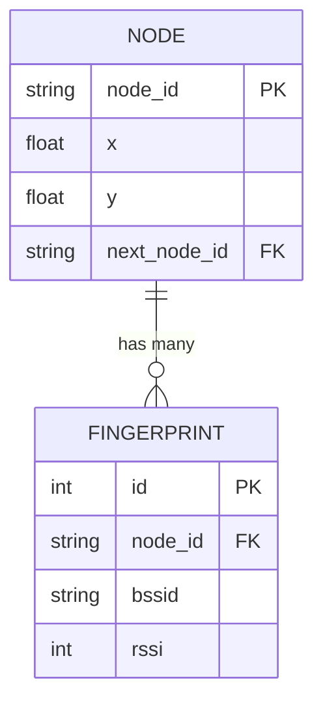
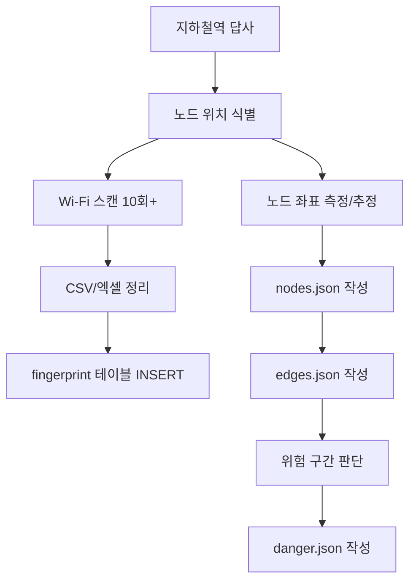

# 06. 데이터 모델

## 6.1 데이터 저장소 구성

본 시스템은 두 종류의 데이터 저장소를 사용한다.

| 저장소 | 보관 데이터 | 형식 |
|---|---|---|
| **MySQL** | Wi-Fi fingerprint 샘플, 노드 메타데이터 | 관계형 테이블 |
| **JSON 파일** | 그래프 구조 (좌표·연결·위험 노드) | `data/*.json` |

### 6.1.1 분리 이유

| 데이터 | MySQL인가, JSON인가? | 이유 |
|---|---|---|
| Wi-Fi 샘플 | **MySQL** | 항목 수가 많음 (노드당 수십~수백 행), 색인·집계 필요 |
| 노드 좌표 | MySQL 또는 JSON | 항목 적음. JSON으로도 충분 |
| 노드 연결 | **JSON** | 그래프 구조가 단순. 메모리 내 dict로 즉시 사용 |
| 위험 노드 | **JSON** | 변경이 드물고 항목 적음 |

> 본 프로젝트는 **구현 단순성을 우선**하여 노드 메타데이터(좌표·연결·위험)를 **JSON 파일**로 통일하여 관리한다. MySQL은 fingerprint 데이터에만 사용한다.

---

## 6.2 MySQL 데이터베이스 ERD

### 6.2.1 ERD



### 6.2.2 테이블 정의

#### `node` 테이블

| 컬럼 | 타입 | 제약 | 설명 |
|---|---|---|---|
| `node_id` | VARCHAR(16) | PK | 노드 ID (예: "A", "B", "gate-1") |
| `x` | FLOAT | NOT NULL | x 좌표 |
| `y` | FLOAT | NOT NULL | y 좌표 |
| `next_node_id` | VARCHAR(16) | FK → `node.node_id`, NULL 허용 | 인접 노드 ID *(설계 검토 필요, §6.5 참조)* |

#### `fingerprint` 테이블

| 컬럼 | 타입 | 제약 | 설명 |
|---|---|---|---|
| `id` | INT | PK, AUTO_INCREMENT | 샘플 행 ID |
| `node_id` | VARCHAR(16) | FK → `node.node_id`, NOT NULL | 측정 위치 노드 |
| `bssid` | VARCHAR(17) | NOT NULL | AP MAC 주소 (예: `"aa:bb:cc:dd:ee:ff"`) |
| `rssi` | INT | NOT NULL | 신호 세기 (dBm, 일반적으로 -30 ~ -90) |

> **참고**: `node` 테이블은 JSON 파일로 대체 가능하므로, 본 프로젝트의 초기 구현에서는 **`fingerprint` 테이블만 MySQL에 두고**, 노드 메타데이터는 JSON으로 관리하는 구성을 권장한다.

### 6.2.3 인덱스 권장 사항

| 테이블 | 인덱스 | 목적 |
|---|---|---|
| `fingerprint` | `(node_id, bssid)` | 노드별 AP 조회 가속 |
| `fingerprint` | `(bssid)` | KNN 거리 계산 시 BSSID 정렬용 |

### 6.2.4 DDL 예시

```sql
CREATE TABLE node (
    node_id      VARCHAR(16)  PRIMARY KEY,
    x            FLOAT        NOT NULL,
    y            FLOAT        NOT NULL,
    next_node_id VARCHAR(16)  NULL,
    FOREIGN KEY (next_node_id) REFERENCES node(node_id)
);

CREATE TABLE fingerprint (
    id       INT           PRIMARY KEY AUTO_INCREMENT,
    node_id  VARCHAR(16)   NOT NULL,
    bssid    VARCHAR(17)   NOT NULL,
    rssi     INT           NOT NULL,
    INDEX idx_node_bssid (node_id, bssid),
    INDEX idx_bssid (bssid),
    FOREIGN KEY (node_id) REFERENCES node(node_id)
);
```

---

## 6.3 그래프 JSON 스키마

### 6.3.1 파일 구성

```
data/
├── nodes.json     # 노드 좌표
├── edges.json     # 노드 간 연결 정보
└── danger.json    # 위험 노드 목록
```

### 6.3.2 `nodes.json` — 노드 좌표

```json
{
  "A": { "x": 0,  "y": 0 },
  "B": { "x": 5,  "y": 0 },
  "C": { "x": 5,  "y": 5 },
  "D": { "x": 5,  "y": 10 },
  "E": { "x": 10, "y": 5 },
  "F": { "x": 10, "y": 10 }
}
```

| 필드 | 타입 | 설명 |
|---|---|---|
| key | string | 노드 ID (전 시스템에서 식별 키) |
| `.x` | number | x 좌표 (단위 무관, 상대 좌표계) |
| `.y` | number | y 좌표 |

### 6.3.3 `edges.json` — 노드 간 연결

```json
{
  "A": ["B"],
  "B": ["A", "C"],
  "C": ["B", "D", "E"],
  "D": ["C", "F"],
  "E": ["C"],
  "F": ["D"]
}
```

- **무방향 그래프**로 가정. `A → B` 가 있으면 `B → A` 도 반드시 있어야 한다.
- 자기 자신을 포함하지 않는다.

### 6.3.4 `danger.json` — 위험 노드 목록

```json
["E"]
```

- 단순 노드 ID의 배열.
- 검사 시 `set` 으로 변환하여 O(1) 조회.

### 6.3.5 (선택) 노드 메타데이터

향후 노드명·시설 종류 등이 필요할 경우 다음과 같이 확장 가능하다.

```json
// nodes.json (확장 형식)
{
  "A": { "x": 0, "y": 0, "name": "1번 출구", "type": "exit" },
  "C": { "x": 5, "y": 5, "name": "개찰구", "type": "gate" }
}
```

> 본 프로젝트의 초기 구현에서는 `x`, `y` 필드만으로 시작하며, 필요 시 `name`, `type` 을 추가한다.

---

## 6.4 데이터 수집 절차

### 6.4.1 수집 대상 데이터

각 노드에서 수집할 데이터는 다음과 같다.

| 항목 | 비고 |
|---|---|
| 노드 위치 좌표 (x, y) | 1회 측정/추정 |
| Wi-Fi AP 신호 (BSSID, RSSI) | **다수 회** 측정 (권장 10회 이상) |

### 6.4.2 수집 환경 표준화

> 데이터 품질 = 전체 정확도 결정

수집 시 다음 조건을 표준화하여 일관성을 확보해야 한다.

| 조건 | 표준값 |
|---|---|
| 측정 자세 | 화면이 하늘, 상단이 임의의 일정 방향 |
| 측정 시간대 | 가능한 동일 시간대 (혼잡도 영향 최소화) |
| 측정 횟수 | 노드당 **10회 이상** |
| 측정 간격 | 측정 간 1~2초 간격 |

### 6.4.3 수집 절차 흐름



### 6.4.4 수집 도구 (구현 예정)

- **Wi-Fi 스캔 수집용 미니 안드로이드 앱** 또는 시중 앱 활용
- 수집 결과를 CSV로 export → 서버에 업로드 → DB INSERT 스크립트 실행

> 데이터 수집은 **팀원 전원의 공동 작업**으로 정의되어 있다 *(08. 일정 및 역할 분담 참조)*.

---

## 6.5 데이터 모델 검토 사항

### 6.5.1 `next_node_id` 단일값 구조의 한계

원본 요구사항 명세서의 `node` 테이블 정의는 `next_node_id` **단일 컬럼**으로 다음 노드를 표현하지만, 이는 **2방향 이상의 갈림길** 을 표현할 수 없다. 갈림길 자체가 노드의 정의이므로 **본질적인 모순**이 존재한다.

### 6.5.2 권장 대안

다음 중 한 가지로 변경할 것을 권장한다.

#### 대안 1: 별도 `edge` 테이블 도입

```sql
CREATE TABLE edge (
    from_node VARCHAR(16),
    to_node   VARCHAR(16),
    PRIMARY KEY (from_node, to_node)
);
```

#### 대안 2: JSON 기반 관리 (본 프로젝트 채택)

`edges.json` 파일로 노드 간 연결을 관리한다. 본 프로젝트에서는 **대안 2** 를 채택한다.

### 6.5.3 채택 사유

- 그래프 변경이 빈번하지 않으므로 트랜잭션이나 동시성 제어가 불필요하다.
- 메모리 내 dict로 즉시 조회 가능하여 Dijkstra 수행 속도가 빠르다.
- 코드와 데이터를 분리할 수 있어 유지보수가 용이하다.
