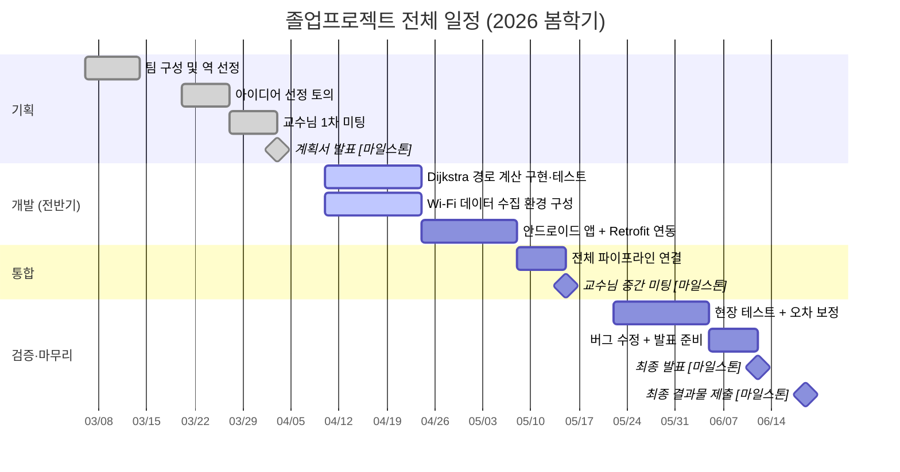
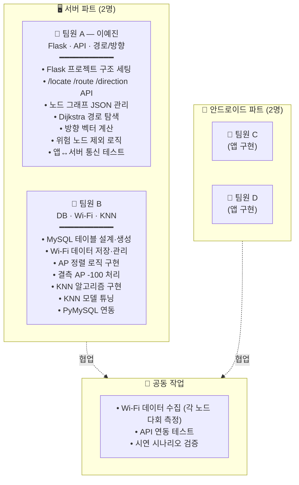

# 08. 일정 및 역할 분담

## 8.1 전체 일정 개요

본 프로젝트의 일정은 **2026년 봄학기 일정**을 기준으로 하며, 4월 계획서 발표 PPT의 마일스톤을 그대로 유지한다. *(시스템 구성은 PPT 이후 변경되었으나 일정은 동일)*

### 8.1.1 핵심 마일스톤

| 일자 | 마일스톤 | 비고 |
|---|---|---|
| 2026-04-03 | **계획서 발표** | 완료 (5주차) |
| 2026-05-15 | **교수님 중간 미팅** | 11주차 |
| 2026-06-12 | **최종 발표** | 15주차 |
| 2026-06-19 | **최종 결과물 제출** | 16주차 |

### 8.1.2 전체 간트 차트

---

## 8.2 주차별 마일스톤

### 8.2.1 전체 일정표

| 주차 | 기간 | 주요 단계 | 담당 |
|---|---|---|---|
| 1~2주차 | 3/6 ~ 3/13 | 팀 구성 및 역 선정 | 공통 |
| 3주차 | 3/20 | 아이디어 선정 토의 | 공통 |
| 4주차 | 3/27 | 교수님 1차 미팅 | 공통 |
| 5주차 | 4/3 | **계획서 발표 [마일스톤]** | 공통 |
| 6~7주차 | 4/10 ~ 4/24 | Dijkstra 경로 계산 구현·테스트 | 서버 |
| 6~7주차 | 4/10 ~ 4/24 | Wi-Fi 데이터 수집 환경 구성 | 서버 |
| 8~9주차 | 4/24 ~ 5/8 | 안드로이드 앱 + Retrofit 연동 | 앱 |
| 10주차 | 5/8 ~ 5/15 | 전체 파이프라인 연결 | 공통 |
| 11주차 | 5/15 ~ 5/22 | **교수님 중간 미팅 [마일스톤]** | 공통 |
| 12~13주차 | 5/22 ~ 6/5 | 현장 테스트 + 오차 보정 | 공통 |
| 14~15주차 | 6/5 ~ 6/12 | 버그 수정 + 발표 준비 | 공통 |
| 15주차 | 6/12 | **최종 발표 [마일스톤]** | 공통 |
| 16주차 | 6/19 | **최종 결과물 제출** | 공통 |

> ※ PPT 단계의 일정은 ESP32 비콘·React Native 등 폐기된 구성 기준이었으나, 본 보고서에서는 **새로운 구성(Wi-Fi + Android + Flask)** 에 맞추어 작업 항목을 재해석하였다.

### 8.2.2 서버 파트 (팀원 A) 세부 일정

| 주차 | 작업 항목 | 산출물 |
|---|---|---|
| 6주차 | Flask 프로젝트 구조 세팅, Hello API, MySQL 연동 확인 | `app.py`, `config.py`, DB 연결 성공 |
| 7주차 | `nodes.json`, `edges.json` 초안 작성 (가짜 데이터 5~6개) + `/direction` API | `data/*.json`, `core/direction.py`, 동작 데모 |
| 8주차 | `/route` API (Dijkstra + 위험 노드 제외) | `core/graph.py`, 단위 테스트 통과 |
| 9주차 | `/locate` API 골격 (KNN은 팀원 B 코드 import) | `api/locate.py`, 통신 시연 |
| 10주차 | 앱(팀 B 안드로이드) 와의 통신 테스트, JSON 형식 합의 | 통신 성공 캡처, 합의 문서 |
| 12~13주차 | 실제 지하철역 데이터 수집 + DB 적재 | fingerprint INSERT 완료 |
| 14주차 | 시연 시나리오 검증, 잔여 버그 수정 | 시연 영상, 발표 자료 |

---

## 8.3 팀 역할 분담

### 8.3.1 팀 구성

| 구분 | 인원 | 팀원 |
|---|---|---|
| 서버 파트 | 2명 | 박경찬, 김화경, 이예진, 최수빈 中 2명 |
| 안드로이드 파트 | 2명 | 박경찬, 김화경, 이예진, 최수빈 中 2명 |

### 8.3.2 역할별 담당 영역

### 8.3.3 역할 상세

#### 팀원 A — Flask / API / 경로·방향 로직 (**이예진**)

| 역할 영역 | 세부 작업 |
|---|---|
| 프로젝트 골격 | Flask 프로젝트 구조 세팅 (`app.py`, `config.py`) |
| API 관리 | `/locate` (틀 + KNN 호출), `/route`, `/direction` 엔드포인트 |
| 데이터 관리 | 노드 그래프 JSON 관리 (좌표, 연결, 방향) |
| 알고리즘 | 경로 탐색 (Dijkstra), 방향 벡터 계산, 위험 노드 제외 로직 |
| 검증 | 앱 ↔ 서버 통신 테스트 |

> **요약**: "API 흐름 + 길찾기 + 방향 계산 담당"

#### 팀원 B — DB / Wi-Fi 처리 / KNN

| 역할 영역 | 세부 작업 |
|---|---|
| DB 설계 | MySQL 테이블 설계 및 생성 (`fingerprint`, `node`) |
| Wi-Fi 처리 | Wi-Fi 데이터 저장·관리, AP 정렬 로직, 결측 AP `-100` 처리 |
| 위치 추정 | KNN 알고리즘 구현 (`knn.py`), KNN 모델 튜닝 |
| 연동 | PyMySQL 연동 |

> **요약**: "위치 추정 엔진 + 데이터 담당"

#### 팀원 C, D — 안드로이드 앱

- 앱 UI 구현 (TalkBack 호환)
- Wi-Fi 스캔, 나침반 센서, 진동 출력
- Retrofit으로 서버 API 호출
- TTS 음성 안내

### 8.3.4 공동 작업 항목

> 데이터 품질 = 전체 정확도 결정

다음 항목은 팀 전원이 함께 수행한다.

| 항목 | 비고 |
|---|---|
| Wi-Fi 데이터 수집 | 각 노드에서 다회 측정. 인원이 많을수록 빠르고 정확 |
| API 연동 테스트 | 서버·앱 양쪽 인원이 함께 디버깅 |
| 시연 시나리오 검증 | 최종 발표 전 단계 |

---

## 8.4 인터페이스 협의 사항

### 8.4.1 팀원 A ↔ B (서버 내부)

| 협의 항목 | 합의 시점 권장 |
|---|---|
| `/locate` 입력 JSON 형식 (BSSID·RSSI 필드명) | 7주차 초 |
| AP 정렬 규칙 (BSSID 사전순 vs DB 입력순) | 7주차 초 |
| `knn.py` 의 함수 시그니처 (입력/출력 타입) | 7주차 초 |
| 노드 ID 명명 규칙 ("A","B" vs "gate-1") | 6주차 |
| `fingerprint` 테이블 스키마 확정 | 6주차 |

### 8.4.2 서버 ↔ 앱

| 협의 항목 | 합의 시점 권장 |
|---|---|
| API URL, 포트, 통신 방식 (HTTP/HTTPS) | 8주차 |
| JSON 응답 형식 (특히 에러 응답) | 8주차 |
| 좌표계 정의 (정북 = 0°, 시계방향 가정) | 8주차 |
| 통신 주기 및 타임아웃 정책 | 9주차 |
| 위험 노드 존재 여부의 응답 표기 | 9주차 |

### 8.4.3 합의 형태

본 합의 사항들은 다음 형태로 기록·관리한다.

- 문서: `docs/05-API명세.md` 의 갱신
- 회의록: 슬랙·노션 등 팀 공용 공간
- 코드: 합의 후 즉시 인터페이스 코드(스텁)로 구현하여 양측이 병렬 개발 가능하게 함
